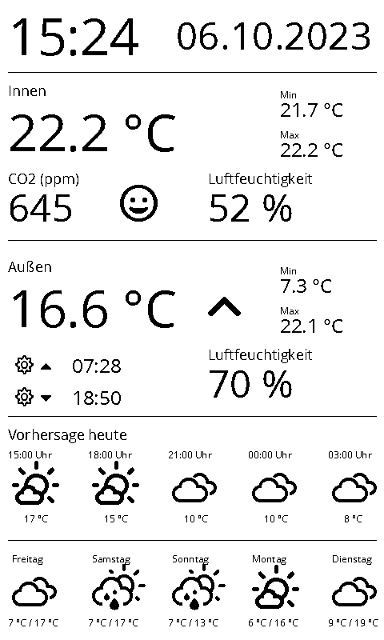
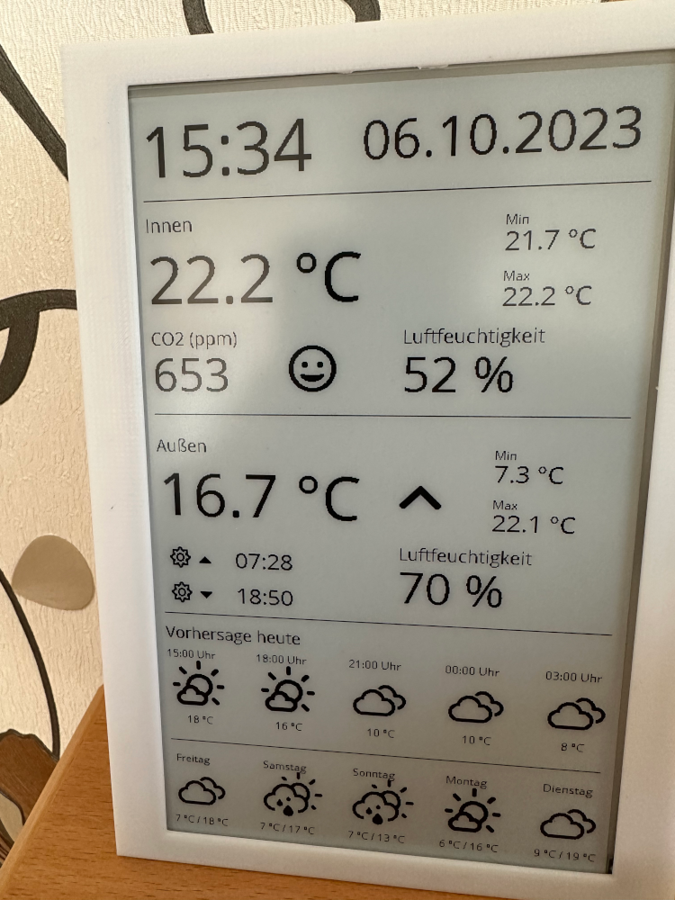

# Netatmo ePaper

## General information

This is a python application that displays data on a Waveshare 7.5" ePaper display.
The following data will be displayed:

- Date and time
- Data from Netatmo indoor and outdoor module
- Weather forecast from openweathermap.org

Example screenshot:



Real life example:



## How to install

### For local development

1. Checkout this repo
2. Create Virtual env (see https://docs.python.org/3/library/venv.html)
3. Install dependencies:
   ```shell
   $ pip install -r requirements-base.txt
   ```
4. Copy `example.yaml` to `config.yaml` and update the file accordingly.
5. Run the application:
   ```shell
   $ python netatmo-epaper/netatmo-epaper.py
   ```

### On Raspberry Pi

1. Checkout this repo
2. Create and activate Virtual env (see https://docs.python.org/3/library/venv.html)
   ```shell
   $ cd netatmo-epaper
   $ python3 -m venv .venv
   $ source .venv/bin/activate
   ```
3. Install dependencies:
   ```shell
   $ pip3 install -r requirements-base.txt -r requirements-pi.txt
   ```
4. Copy `example.yaml` to `config.yaml` and update the file accordingly.
5. Run the application:
   ```shell
   $ python3 netatmo-epaper/netatmo-epaper.py
   ```
6. Optional: (re)start automatically, e.g. using pm2:
   ```shell
   $ pm2 start /home/pi/netatmo-epaper/netatmo-epaper/netatmo-epaper.py --name "netatmo-epaper.py" --interpreter "/home/pi/netatmo-epaper/.venv/bin/python"
   $ pm2 save
   ```

## Libraries used

The following libraries made this project much easier:

- [Waveshare ePaper libraries and examples](https://github.com/waveshare/e-Paper)
- [netatmo-api-python](https://github.com/philippelt/netatmo-api-python) for retrieving data from the Netatmo API
- [pyowm](https://github.com/csparpa/pyowm) for retreieving data from openweathermap.org
- [Pillow](https://github.com/python-pillow/Pillow) for image processing
